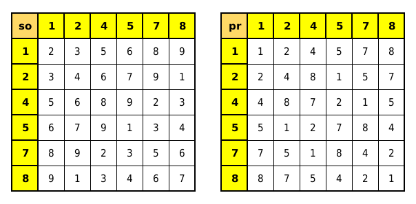

# 🔐 CriptoMath — Aprendendo Criptografia com Matemática

🌐 **Acesse o projeto online:**  
👉 [https://prof-marcelo-pantaleao.github.io/cripto-math/](https://prof-marcelo-pantaleao.github.io/cripto-math/)

---

## 🎯 Objetivo Didático

O **CriptoMath** é um projeto desenvolvido pelo **Prof. Marcelo Pantaleão** para introduzir os conceitos fundamentais da **criptografia RSA** de forma **visual, interativa e compreensível para alunos do 9º ano do Ensino Fundamental e todos os anos do Ensino Médio**.

A proposta é mostrar que a matemática está presente em tecnologias modernas — como segurança digital, autenticação e mensagens criptografadas — e que ela pode ser **divertida, lógica e envolvente**.

---

## 🧩 O que o aluno aprende

- O conceito de **chave pública (n)** e como ela é formada a partir de dois primos.  
- O papel da **raiz digital (rd)** e suas propriedades numéricas.  
- Como **somar possíveis pares de primos (p + q)** para encontrar combinações que possam “quebrar” a chave pública.  
- A relação entre **álgebra, divisibilidade, fatoração e lógica modular**.  
- Que a matemática pode ser usada **para proteger informações**, mas também **para analisá-las**.

---

## 💡 Funcionalidades do Sistema

- 💬 Interface com **login e senha simulados** — torna a experiência mais realista.  
- 🎲 **Geração automática de chaves públicas** válidas (ignorando raízes digitais 3, 6 e 9).  
- 🧮 **Explicação passo a passo dinâmica** durante a tentativa de quebra da chave.  
- 📱 **Interface responsiva** — funciona bem em celulares, tablets, notebooks, PCs e até TVs.  
- 🔍 **Animação explicativa** mostrando o raciocínio de cada tentativa.  

---

## 🔢 Base Matemática

### 🔹 Conjunto de primos utilizados
`P100 = {3, 5, 7, 11, 13, 17, 19, 23, 29, 31, 37, 41, 43, 47, 53, 59, 61, 67, 71, 73, 79, 83, 89, 97}`  

> ⚠️ Nenhum primo (exceto o 3) pode ter raiz digital 3, 6 ou 9.  
> Por isso, chaves com essas raízes digitais são ignoradas.

---

## 🧮 Cálculo da raiz digital

A **raiz digital (rd)** de um número é obtida somando seus algarismos até restar apenas um dígito.

Exemplo:
```
n = 391
rd(391) = 3 + 9 + 1 = 13 → 1 + 3 = 4
```

---

## 🔗 Uso das tabelas SO e PR

O CriptoMath usa duas tabelas para **relacionar raízes digitais das somas possíveis** (p + q) e das **raízes digitais correspondentes dos primos p e q**.

Essas tabelas estão representadas na imagem abaixo:



---

### 🧭 **Como usar essas tabelas**

1. Calcule a **raiz digital da chave pública (rd(n))**.  
2. Localize essa raiz digital na **tabela SO** — ela mostra as **possíveis raízes digitais das somas (p + q)**.  
3. Para cada valor encontrado, vá até a **tabela PR**, que mostra **quais raízes digitais dos primos (p e q)** correspondem àquela soma.  
4. Gere as combinações coerentes de `(p, q)` com base nesse mapeamento.  
5. Resolva a equação:
   ```
   x² - soma*x + n = 0
   ```
   e verifique se as soluções são primos em `P100`.  
6. Quando encontrar um par válido, a chave é “quebrada”.

---

### 🧠 Exemplo didático

Se `n = 201` → `rd(201) = 3`  
Na tabela SO, procure a linha correspondente à **raiz digital 3**.  
As raízes digitais possíveis das somas `(p + q)` serão mapeadas conforme a linha.  
Em seguida, use a tabela PR para identificar **as raízes digitais possíveis dos primos correspondentes**.  

Esse processo direciona o algoritmo e **reduz o espaço de busca**, simulando um raciocínio humano de “análise matemática” da chave.

---

## 👨‍🏫 Autor

**Prof. Marcelo Pantaleão**  
📘 Licenciado em Matemática pela UNESP — São José do Rio Preto (2005)  
🎓 Professor de Matemática desde 2006  
💡 Criador do projeto **CriptoMath — Matemática Aplicada à Criptografia**

---

## 🧭 Créditos e Licença

Este projeto é de uso **didático e livre para fins educacionais**.  
Sinta-se à vontade para adaptá-lo, remixá-lo e aprimorá-lo em sala de aula — desde que os créditos sejam mantidos.  

**© 2025 Prof. Marcelo Pantaleão — Todos os direitos reservados.**
